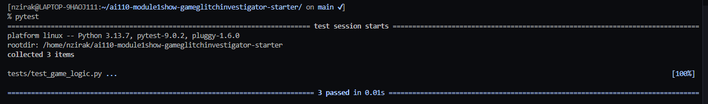

# 🎮 Game Glitch Investigator: The Impossible Guesser

## 🚨 The Situation

You asked an AI to build a simple "Number Guessing Game" using Streamlit.
It wrote the code, ran away, and now the game is unplayable. 

- You can't win.
- The hints lie to you.
- The secret number seems to have commitment issues.

## 🛠️ Setup

1. Install dependencies: `pip install -r requirements.txt`
2. Run the broken app: `python -m streamlit run app.py`

## 🕵️‍♂️ Your Mission

1. **Play the game.** Open the "Developer Debug Info" tab in the app to see the secret number. Try to win.
2. **Find the State Bug.** Why does the secret number change every time you click "Submit"? Ask ChatGPT: *"How do I keep a variable from resetting in Streamlit when I click a button?"*
3. **Fix the Logic.** The hints ("Higher/Lower") are wrong. Fix them.
4. **Refactor & Test.** - Move the logic into `logic_utils.py`.
   - Run `pytest` in your terminal.
   - Keep fixing until all tests pass!

## 📝 Document Your Experience

- [ ] Describe the game's purpose.
- [ ] Detail which bugs you found.
- [ ] Explain what fixes you applied.
-During this project I used GitHub Copilot and ChatGPT to investigate and fix bugs in the guessing game.One major issue was that the hint logic was reversed. When a guess was higher than the secret number the game incorrectly told the player to go higher instead of lower. With help from AI tools I located the bug in the `check_guess` function and corrected the logic.Another issue was that guesses outside the allowed range were accepted. I fixed this by adding validation in the `parse_guess` function.To verify the fixes I ran the game using Streamlit and created automated tests with pytest to confirm that the guessing logic works correctly.

## 📸 Demo

- [ ] [Insert a screenshot of your fixed, winning game here]
- To run the game locally:

1. Install the required packages:
pip install -r requirements.txt
2. Start the Streamlit app:
streamlit run app.py
3. Open the local URL shown in the terminal (usually http://localhost:8501).
The game will allow the player to guess a number within a difficulty-based range and provide hints 

## 🚀 Stretch Features

- [ ] [If you choose to complete Challenge 4, insert a screenshot of your Enhanced Game UI here]
